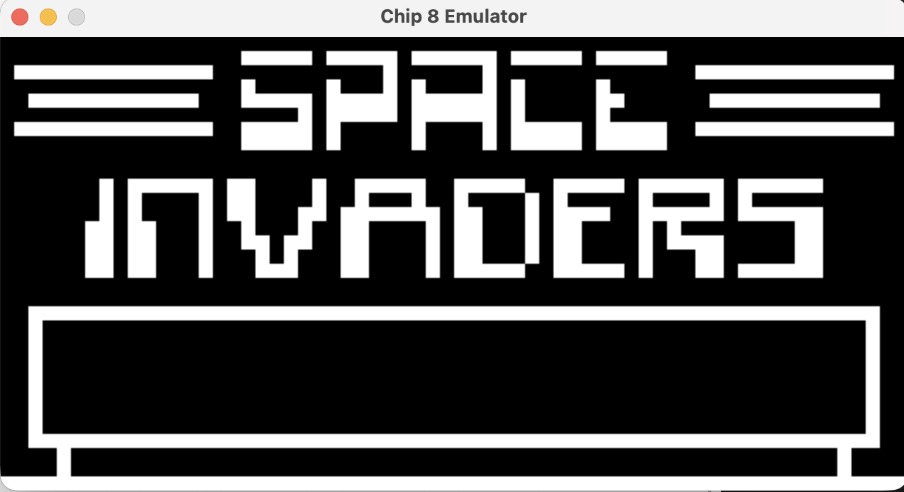
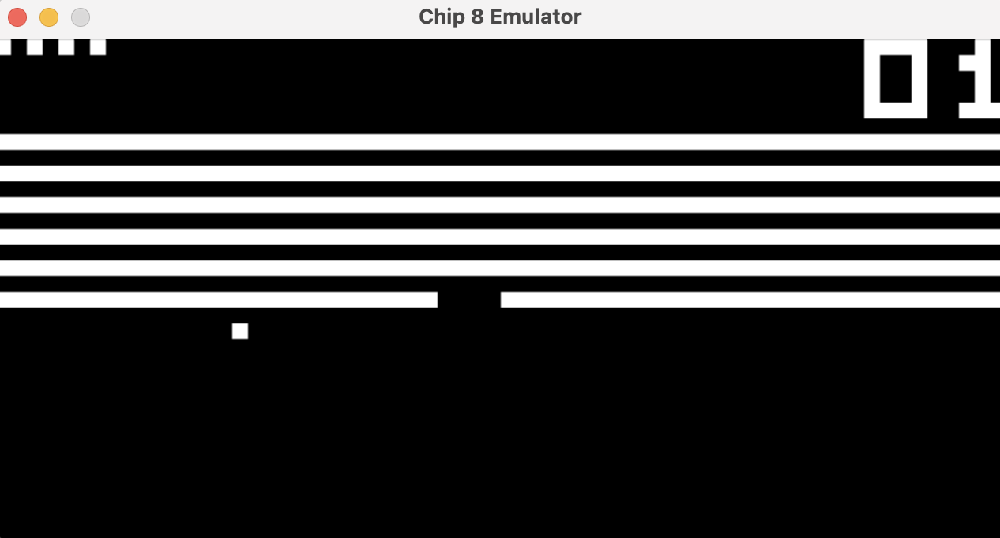
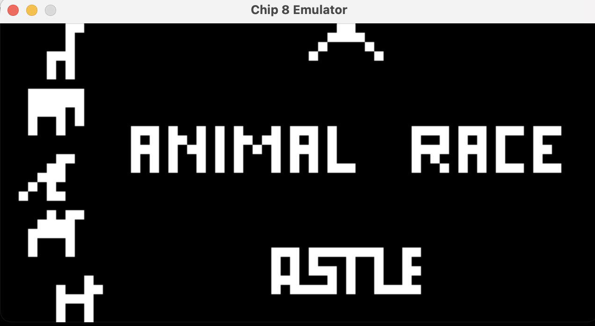

# CHIP-8 Emulator

A high-performance, cross-platform **CHIP-8 interpreter** written in **C++17** using **SDL2** for graphics and input handling. This project emulates the original 1970s virtual computer, capable of running classic ROMs like Space Invaders, Tetris, and Brix.

## Features

- **Accurate Opcode Emulation:** Full support for all 35 original CHIP-8 instructions, including subroutines, timers, and bitwise operations.
- **Modern Rendering:** Uses SDL2 Texture Streaming and Hardware Acceleration to scale the native 64x32 resolution to modern display sizes.
- **Flexible Keymapping:** Bridges the 16-key hexadecimal keypad to a modern QWERTY layout

## Prerequisites

Before building, ensure you have the following installed:

- **CMake** (v3.14+)
- **SDL2** Library (via Homebrew on macOS: `brew install sdl2`)
- A C++17 compatible compiler (Clang/LLVM, GCC, or MSVC)

## Building the Project

1. **Clone the repository:**

```bash
git clone https://github.com/axie22/Chip8Emulator.git
cd Chip8Emulator

```

2. **Generate build files:**

```bash
mkdir build && cd build
cmake ..

```

3. **Compile:**

```bash
make

```

## Usage Guide

To run a ROM, provide the path to the `.ch8` file as a command-line argument:

```bash
./chip8 path/to/rom/invaders.ch8

```

### Key Map

The original CHIP-8 used a 4x4 hex keypad. This emulator maps those keys to your QWERTY keyboard as follows:

| Chip-8 Key | QWERTY Key | Chip-8 Key | QWERTY Key |
| :--------: | :--------: | :--------: | :--------: |
|   **1**    |   **1**    |   **2**    |   **2**    |
|   **3**    |   **3**    |   **C**    |   **4**    |
|   **4**    |   **Q**    |   **5**    |   **W**    |
|   **6**    |   **E**    |   **D**    |   **R**    |
|   **7**    |   **A**    |   **8**    |   **S**    |
|   **9**    |   **D**    |   **E**    |   **F**    |
|   **A**    |   **Z**    |   **0**    |   **X**    |
|   **B**    |   **C**    |   **F**    |   **V**    |

> **💡 Tip:** If a game like _Space Invaders_ says "Press 4 to go Left", it refers to the **Chip-8 Key 4**. Check the table above → You should press **Q** on your keyboard.

## Sample Games

<p align="center">
  
  
  
</p>
<p align="center">
  <i>Space Invaders • Breakout • Animal Race</i>
</p>

---

## Technical Highlights

### Decoupled Timing Logic

One of the core challenges was ensuring the game logic didn't run at the speed of the host processor. I implemented a delta-time accumulator system to sync the CPU cycles and the 60Hz hardware timers independently.

### Memory Layout

- **Total Memory:** 4096 bytes (0x000 to 0xFFF).
- **ROM Start:** 0x200 (512 bytes).
- **Font Data:** Built-in font set stored at 0x50.
